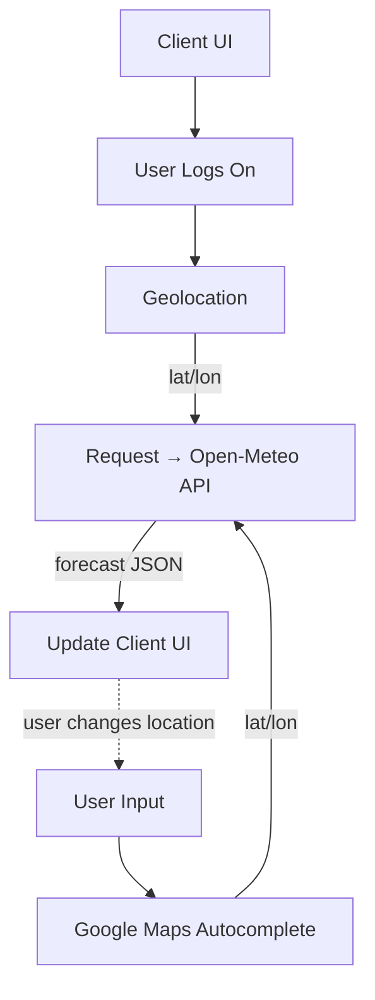

# Frontend Mentor - Weather app solution

This is a solution to the [Weather app challenge on Frontend Mentor](https://www.frontendmentor.io/challenges/weather-app-K1FhddVm49) [30-Day Hackathon](https://www.frontendmentor.io/articles/introducing-the-frontend-mentor-30-day-hackathon). Frontend Mentor challenges help you improve your coding skills by building realistic projects.

## Table of contents

- [Overview](#overview)
  - [The challenge](#the-challenge)
  - [Screenshot](#screenshot)
  - [Links](#links)
- [My process](#my-process)
  - [Built with](#built-with)
  - [Mermaid Diagram](#mermaid-diagram)
  - [What I learned](#what-i-learned)
  - [Stretch Goals](#stretch-goals)
- [Author](#author)

## Overview

### The challenge

Users should be able to:

- Search for weather information by entering a location in the search bar
- View current weather conditions including temperature, weather icon, and location details
- See additional weather metrics like "feels like" temperature, humidity percentage, wind speed, and precipitation amounts
- Browse a 7-day weather forecast with daily high/low temperatures and weather icons
- View an hourly forecast showing temperature changes throughout the day
- Switch between different days of the week using the day selector in the hourly forecast section
- Toggle between Imperial and Metric measurement units via the units dropdown
- Switch between specific temperature units (Celsius and Fahrenheit) and measurement units for wind speed (km/h and mph) and precipitation (millimeters) via the units dropdown
- View the optimal layout for the interface depending on their device's screen size
- See hover and focus states for all interactive elements on the page

### Screenshot


### Links

- Solution URL: [GitHub](https://github.com/ajkendal/weather-app-frontend-mentor)
- Live Site URL: [Weather App](https://weather-app-frontend-mentor.vercel.app/)

## My process

### Built with

- [HTML5](https://developer.mozilla.org/en-US/docs/Web/Guide/HTML/HTML5)
- [SCSS Modules](https://sass-lang.com/)
- [Flexbox](https://developer.mozilla.org/en-US/docs/Web/CSS/CSS_flexible_box_layout/Basic_concepts_of_flexbox)
- [CSS Grid](https://developer.mozilla.org/en-US/docs/Web/CSS/CSS_grid_layout)
- [Vite](https://vitejs.dev/)
- [React.js](https://react.dev/)
- [Geolocation API](https://developer.mozilla.org/en-US/docs/Web/API/Geolocation_API)
- [Open-Meteo API](https://www.npmjs.com/package/openmeteo)
- [Google Maps Autocomplete](https://www.npmjs.com/package/react-google-autocomplete)
- [Figma](https://www.figma.com/)
- [Vercel](https://vercel.com/)
- [GitHub](https://github.com/)
- [Google Fonts](https://fonts.google.com/)

### Mermaid Diagram



### What I learned

Here are a couple of code snippets from this project that I'm proud of, with a short explanation of why they matter.

1. Robust Open‑Meteo shaping with correct timezone handling (apply offset once):

```ts
// src/utils/getWeather.tsx (excerpt)
const responses = await fetchWeatherApi(url, params)
const response = responses[0]
const current = response.current()!
const hourly = response.hourly()!
const daily = response.daily()!

// Apply the local offset once when building time arrays
const utcOffsetSeconds = new Date().getTimezoneOffset() * 60

const weatherData = {
  hourly: {
    time: Array.from(
      {
        length:
          (Number(hourly.timeEnd()) - Number(hourly.time())) /
          hourly.interval(),
      },
      (_, i) =>
        new Date(
          (Number(hourly.time()) + utcOffsetSeconds + i * hourly.interval()) *
            1000
        )
    ),
    temperature_2m: hourly.variables(0)!.valuesArray(),
    weather_code: hourly.variables(1)!.valuesArray(),
  },
  // ...daily/current omitted for brevity
}
```

Why: It avoids the classic “one-day-off” bug by not re‑applying the offset per interval and builds precise Date objects for rendering.

2. Smooth vertical drag‑to‑scroll for the hourly list:

```tsx
// src/components/Hourly.tsx (excerpt)
const scrollRef = useRef<HTMLDivElement>(null)
const isDown = useRef(false)
const startY = useRef(0)
const scrollTop = useRef(0)

const handleMouseDown = (e: React.MouseEvent) => {
  isDown.current = true
  startY.current =
    e.pageY - (scrollRef.current?.getBoundingClientRect().top || 0)
  scrollTop.current = scrollRef.current?.scrollTop || 0
  document.body.style.userSelect = 'none'
}

const handleMouseMove = (e: React.MouseEvent) => {
  if (!isDown.current) return
  e.preventDefault()
  const y = e.pageY - (scrollRef.current?.getBoundingClientRect().top || 0)
  const walk = y - startY.current
  if (scrollRef.current) scrollRef.current.scrollTop = scrollTop.current - walk
}

const handleMouseUp = () => {
  isDown.current = false
  document.body.style.userSelect = ''
}
```

Why: It keeps the UI compact on small screens while offering a natural “grab to scroll” interaction without extra libraries.

### Stretch Goals

1. Add geolocation detection to automatically show weather for the user's current location on first visit
2. Implement a favorites/saved locations system where users can bookmark frequently checked locations
3. Implement a "Compare Locations" feature to view weather side-by-side for multiple locations
4. Include UV index, visibility, and air pressure data (available via Open-Meteo)
5. Add sunrise/sunset times with visual indicators
6. Add animated weather backgrounds that change based on current conditions
7. Implement voice search functionality
8. Create dark/light mode themes that adapt to the time of day
9. Add progressive web app (PWA) capabilities for mobile installation

## Author

- Website - [Amanda J Kendal-Brown](https://ajkendal.github.io/)
- LinkedIn - [@akendalb](https://www.linkedin.com/in/akendalb)
- GitHub - [@ajkendal](https://github.com/ajkendal/)
- Frontend Mentor - [@yourusername](https://www.frontendmentor.io/profile/ajkendal)
