# Frontend Mentor - Weather app solution

This is a solution to the [Weather app challenge on Frontend Mentor](https://www.frontendmentor.io/challenges/weather-app-K1FhddVm49) [30-Day Hackathon](https://www.frontendmentor.io/articles/introducing-the-frontend-mentor-30-day-hackathon). Frontend Mentor challenges help you improve your coding skills by building realistic projects.

## Table of contents

- [Overview](#overview)
  - [The challenge](#the-challenge)
  - [Screenshot](#screenshot)
  - [Links](#links)
- [My process](#my-process)
  - [Built with](#built-with)
  - [Mermaid Diagram](#mermaid-diagram)
  - [What I learned](#what-i-learned)
  - [Stretch Goals](#stretch-goals)
- [Author](#author)

## Overview

### The challenge

Users should be able to:

- Search for weather information by entering a location in the search bar
- View current weather conditions including temperature, weather icon, and location details
- See additional weather metrics like "feels like" temperature, humidity percentage, wind speed, and precipitation amounts
- Browse a 7-day weather forecast with daily high/low temperatures and weather icons
- View an hourly forecast showing temperature changes throughout the day
- Switch between different days of the week using the day selector in the hourly forecast section
- Toggle between Imperial and Metric measurement units via the units dropdown
- Switch between specific temperature units (Celsius and Fahrenheit) and measurement units for wind speed (km/h and mph) and precipitation (millimeters) via the units dropdown
- View the optimal layout for the interface depending on their device's screen size
- See hover and focus states for all interactive elements on the page

### Screenshot


Add a screenshot of your solution. The easiest way to do this is to use Firefox to view your project, right-click the page and select "Take a Screenshot". You can choose either a full-height screenshot or a cropped one based on how long the page is. If it's very long, it might be best to crop it.

Alternatively, you can use a tool like [FireShot](https://getfireshot.com/) to take the screenshot. FireShot has a free option, so you don't need to purchase it.

Then crop/optimize/edit your image however you like, add it to your project, and update the file path in the image above.

**Note: Delete this note and the paragraphs above when you add your screenshot. If you prefer not to add a screenshot, feel free to remove this entire section.**

### Links

- Solution URL: [GitHub](https://github.com/ajkendal/weather-app-frontend-mentor)
- Live Site URL: [Weather App](https://weather-app-frontend-mentor.vercel.app/)

## My process

### Built with

- [HTML5](https://developer.mozilla.org/en-US/docs/Web/Guide/HTML/HTML5)
- [SCSS Modules](https://sass-lang.com/)
- [Flexbox](https://developer.mozilla.org/en-US/docs/Web/CSS/CSS_flexible_box_layout/Basic_concepts_of_flexbox)
- [CSS Grid](https://developer.mozilla.org/en-US/docs/Web/CSS/CSS_grid_layout)
- [Vite](https://vitejs.dev/)
- [React.js](https://react.dev/)
- [Geolocation API](https://developer.mozilla.org/en-US/docs/Web/API/Geolocation_API)
- [Open-Meteo API](https://www.npmjs.com/package/openmeteo)
- [Google Maps Autocomplete](https://www.npmjs.com/package/react-google-autocomplete)
- [Figma](https://www.figma.com/)
- [Vercel](https://vercel.com/)
- [GitHub](https://github.com/)
- [Google Fonts](https://fonts.google.com/)

### Mermaid Diagram

```mermaid
flowchart TD
    A[Client UI] --> B[User Logs On]
    B --> C[Geolocation]
    C -->|lat/lon| D[Request → Open-Meteo API]
    E[User Input] --> F[Google Maps Autocomplete]
    F -->|lat/lon| D

    D -->|forecast JSON| G[Update Client UI]

    %% optional: show that user can update input repeatedly
    G -. user changes location .-> E
```



### What I learned

Use this section to recap over some of your major learnings while working through this project. Writing these out and providing code samples of areas you want to highlight is a great way to reinforce your own knowledge.

To see how you can add code snippets, see below:

```html
<h1>Some HTML code I'm proud of</h1>
```

```css
.proud-of-this-css {
  color: papayawhip;
}
```

```js
const proudOfThisFunc = () => {
  console.log('🎉')
}
```

If you want more help with writing markdown, we'd recommend checking out [The Markdown Guide](https://www.markdownguide.org/) to learn more.

**Note: Delete this note and the content within this section and replace with your own learnings.**

### Stretch Goals

1. Add geolocation detection to automatically show weather for the user's current location on first visit
2. Implement a favorites/saved locations system where users can bookmark frequently checked locations
3. Implement a "Compare Locations" feature to view weather side-by-side for multiple locations
4. Include UV index, visibility, and air pressure data (available via Open-Meteo)
5. Add sunrise/sunset times with visual indicators
6. Add animated weather backgrounds that change based on current conditions
7. Implement voice search functionality
8. Create dark/light mode themes that adapt to the time of day
9. Add progressive web app (PWA) capabilities for mobile installation

## Author

- Website - [Amanda J Kendal-Brown](https://ajkendal.github.io/)
- LinkedIn - [@akendalb](https://www.linkedin.com/in/akendalb)
- GitHub - [@ajkendal](https://github.com/ajkendal/)
- Frontend Mentor - [@yourusername](https://www.frontendmentor.io/profile/ajkendal)
